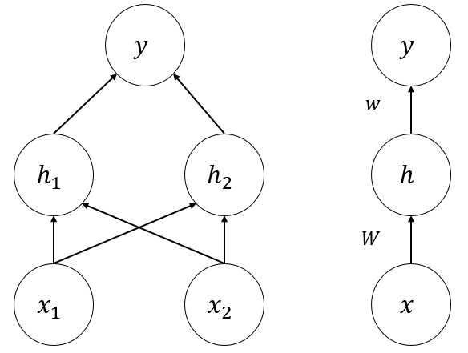
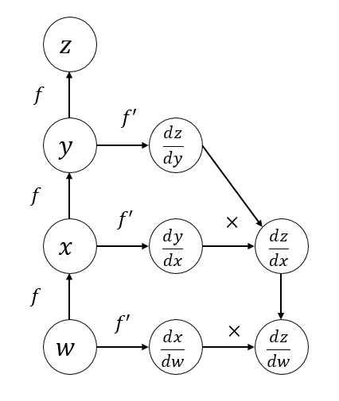

# 深度前馈网络笔记

**深度前馈网络(Deep Feedforward Network)**,也叫**做前馈神经网络(Feedforward Neural Network)**或者**多层感知器(Multi-Layer Perceptron, MLP)**.它是最典型的深度学习模型.是其它模型的基础.为了简便,下面我们以"前馈网络"来称呼它.

前馈网络本质就是一个分类器$y=f(x;\theta)$,将输入$x$映射到一个类别$y$.我们的目的是学习参数$\theta$,使模型能够进行最佳的预测.

前馈网络被称作"前馈"的原因是,输入$x$单向流过网络,最终产生输出.而被称作"网络",是因为模型通常使用许多不同函数复合在一起表示,例如$f(x)=f^{(3)}(f^{(2)}(f^{(1)}(x)))$.这样的链式结构是神经网络常用的结构.

其中,$f^{(1)}$被称为网络的第一层,$f^{(2)}$称为网络的第二层,$f^{(3)}$称为网络的**输出层**.链的长度叫做网络的**深度**.

在神经网络训练的过程中,我们让$f(x)$去匹配$f^*(x)$的值,$f^ *(x)$由训练数据提供,每个样本都伴随着一个标签$y$(在一些情况中,训练数据包含一些噪声点,所以实际上$y\approx f^ *(x)$).

训练样本告诉输出层,网络应该产生一个接近$y$的输出,但是训练样本不关心其它层应该这么做.学习算法必须自己学习到怎么调整其它层的行为以让$f$逼近$f^*$.因为训练数据并没有给出除了输出层以外层应该产生什么输出,所以这些层叫做**隐藏层**.

前馈网络受到神经科学的启发,按照神经元的方式构造网络.每一层包含了多个**单元**,每个单元表示一个向量到标量的函数,它接收的输入来源于其它许多单元,并计算它自己的激活值.

一个单元实际上就是一个线性模型.线性模型是一种非常不错的模型,它们能够高效且可靠地拟合,但是线性模型只能解决线性问题.而现实中大部分问题都是非线性的.

为了扩展线性模型来表示非线性函数,可以把线性模型作用于一个经过$\phi$变换后的结果上.即作用于$\phi(x)$上.这里的$\phi$是非线性的.深度学习,或者说神经网络的目的,就是去习得这个$\phi$.

## 从XOR认识前馈网络

XOR是一个简单但是颇具代表性的例子.XOR的输入$\mathbb{X}=\lbrace [ 0,0]^T, [ 0,1]^T, [1, 0]^T, [ 1,1]^T \rbrace$,它们对应的标签是:$\mathbb{Y}= \lbrace 0,1,1,0 \rbrace$.我们把这四个点画在坐标轴上面,会发现根本无法用一条直线去划分它们.也就是说无法用线性模型去解决问题.

我们需要引入一个非常简单的前馈网络,如下图所示:

这个网络有一层隐藏层,隐藏层保存向量$h$,这是通过线性模型得到的.输出层同样是线性模型,但是它现在使用$h$作为输入.

两个线性模型分别是:$h=f^{(1)}(x;W,c)$和$y=f^{(2)}(h;w,b)$.

但是如果两个都是线性模型,最终模型还是线性的,所以我们需要对隐藏层的输出做一定处理,使之变为非线性的.

这里采取的做法是在隐藏层的输出加上一个**激活函数**,把输出结果变为非线性的,即:$h=g(W^Tx+c)$.在现代神经网络中,一般使用ReLU函数作为隐藏层的激活函数,即:$g(z)=\max \lbrace 0,z \rbrace$.

现在,我们的整个网络是:

$$f(x;W,c,w,b)=w^T\max\lbrace0,W^Tx+c\rbrace+b$$

这个模型就可以很好地解决XOR问题.

那么,现在的问题就在于,如何设计一个算法,让模型根据输入的训练数据,自动训练这些参数了.

## 基于梯度训练前馈网络

使用梯度下降法训练前馈网络是一件非常简单而又传统的事情.在训练前,我们需要指定损失函数,训练时,需要指定一个优化器以及我们需要训练的模型.

但是和传统机器学习算法的区别是,因为神经网络都是非线性的,损失函数基本都是非凸的.我们无法使用传统的凸优化理论去训练参数(凸优化被大量应用于SVM,逻辑回归等机器学习算法).我们只能通过不断地迭代去逼近损失函数的最低值.

损失函数,优化器的选择都是需要在建模前完成的.优化器在这里仅仅涉及到梯度下降法.还有很多对梯度下降改进的优化器,在[优化方法笔记]()中,有关于这些改进优化器的介绍.

下面先来看损失函数的选择.

### 损失函数

在大多数情况下,参数模型定义了一个分布$p(y|x;\theta)$,我们可以使用最大似然原理,也就是使用交叉熵作为我们的损失函数.

则损失函数可以写为:

$$J(\theta)=-\mathbb{E}_{\mathbf{x},\mathbf{y}\sim\hat{p} _{data}}\log p _{model}(y|x)$$

使用最大似然导出损失函数减少了我们设计损失函数的负担,只要得到了模型的分布,我们就可以直接写出损失函数.

使用交叉熵作为损失函数有一个不同寻常的特性,在实践中训练的时候,它往往没有最小值.后面的正则化技术可以修正这一问题,防止模型不会获得无限制的收益.

### 输出单元

我们知道,前馈网络有一组隐藏输出$h=f(x;\theta)$(也叫隐藏特征),输出层的作用是对这些隐藏特征做一些额外的变换,得到最终的输出结果.

#### 线性单元

线性单元式一种最简单地输出单元,它直接对特征做线性变换然后产生输出.即给定特征$h$,线性输出单元产生一个向量:

$$\hat{y}=W^Tx+b$$

线性输出单元产生输出常被我们看做条件高斯分布的均值,即:

$$p(y|x)=\mathcal{N}(y;\hat{y},I)$$

则我们的目标就是最小化这个高斯分布和数据分布的交叉熵,而对高斯分布交叉熵实际上就是均方误差.也就是说,在使用线性单元作为输出的时候,我们可以直接把均方误差作为损失函数.

因为线性单元不会饱和(即梯度消失),所以它易于采用基于梯度的优化算法.

#### Sigmoid单元

Sigmoid单元的输出是一个Bernoulli分布,也就是它适合用来预测二值型变量$y$(只有两个取值)的值.

Sigmoid输出的定义为:

$$\hat{y}=\sigma(w^Th+b)$$

Sigmoid输出单元具有两个部分,首先,使用一个线性层来计算$z=w^T+b$,其次再使用Sigmoid激活函数把$z$转换为概率.

注意Sigmoid函数是容易饱和的,当$z$很大的适合,Sigmoid函数会趋向于$y=1$函数,若$z$很小,则Sigmoid干脆趋向于0了.所以如果采用均方误差作为损失函数,那么当Sigmoid饱和时,损失函数也就出现了饱和,这就出现了梯度消失,对训练是不利的.

在理论上,Sigmoid的范围在$(0,1)$,所以对其取对数似然似乎没有问题.但是在软件中,计算机会把非常小得数字看作0,所以对数可能会产生负无穷.所以在软件实现中,我们一般把对数似然写成$z$的函数而不是$\sigma(z)$的函数.

#### Softmax单元

Softmax函数是Sigmoid函数的扩展,常用作多分类器的输出,用来表示$n$个不同类别上的概率分布.

在二值分类中,我们希望计算一个单独的数:

$$\hat{y}=P(y=1|x)$$

要求这个数在0到1之间,并且可以很好地用基于对数似然的梯度优化它,因此我们选择去预测另外一个数:

$$z=\log\hat{P}(y=1|x)$$

对其指数化和归一化,就得到了由Sigmoid控制的Bernoulli分布:

$$\hat{P}(y=1|x)=\frac{\exp(z)}{\hat{P}(y=0|x)}=\frac{\exp(z)}{1-\exp(z)}=\sigma(z)$$

以上是导出Sigmoid的过程,对于Softmax函数,我们推广到有$n$个值的离散型变量的情况.现在需要创造一个输出向量$\hat{y}$,它的每个元素是$\hat{y}_i=P(y=i|x)$.我们不仅要求$\hat{y}_i$介于0到1之间,还要求整个向量的和为1.

导出方法和Sigmoid类似,首先,线性层预测出未归一化的对数概率:

$$z=W^Th+b$$

其中,$z_i=P(y=i|x)$.Softmax的作用是对$z$进行指数化和归一化,有:

$$\mathbf{softmax}(z)_i=\frac{\exp(z_i)}{\sum_j\exp(z_j)}$$

在实际的软件工程中,可以将softmax的结果取log,这样在对数似然的时候log可以抵消softmax中的exp:

$$\mathbf{logsoftmax}(z)_i=z_i-\log\sum_j\exp(z_j)$$

这是一个非常好的输出函数,因为第一项$z_i$总是对损失函数有直接贡献,即使第二项的贡献很小,也不会出现梯度消失的情况.我们可以把第二项大致近似为$\max_jz_j$.我们从中获取的信息是,负对数似然总是在强烈地乘法最活跃的不正确预测.如果正确答案已经具有了softmax的最大输入,则$\log\sum_j\exp(z_j)\approx \max_jz_j = z_i$.这两项将会大致抵消,这个样本对训练的贡献将会很小.

和Sigmoid函数一样,softmax在输入极端正或极端负的情况下会趋向饱和,会产生梯度消失的问题.因此,如果使用softmax,一般使用对数似然的损失函数,这可以在一定程度上抵消这种饱和.

softmax内部实际上存在了一种"竞争"关系.因为softmax输出向量的和总为1,所以一个单元的值增加必然导致其它单元的值减少.

再来说一下softmax这个词的来源.softmax来源于argmax函数,这种函数产生一个one-hot向量(只有一个元素为1,其余为元素都为0),但是这个函数不是连续可微.softmax就是argmax的"软化"版本.

## 隐藏单元

一般来说,我们都使用整流型单元$g(z)=\max\lbrace0,z\rbrace$作为我们的隐藏层输出.

这个函数在$z=0$时是不可微的,似乎不能得到有效的训练.但是在实际中,梯度下降法对这个模型仍然可以表现得足够好.因为神经网络的训练算法通常不会达到损失函数的局部最小值,而仅仅是显著地减少它.

所以事实上我们并不要求网络能够找到损失函数导数为0的那个点.

具体做法是,$g(z)$拥有左导数和右导数,左导数是紧邻$z$左边的导数,右导数是紧邻右边的导数.对于$z$比较大的点,左导数和右导数一般是相等的.在$z=0$时,左导数是0,右导数是1.这时我们可以选择一个数作为梯度返回,而不是认为该店不可微而报错.

一般而言,都使用线性模型来计算隐藏单元的仿射变换:$z=W^Tx+b$.

整流型单元易于优化,因为它们和线性单元非常类似.它和线性单元的区别在于一半的定义域输出为0.这使得只要整流单元处于激活状态(即$z>0$),则梯度都能保持大而一致.在激活时,它的二阶导数几乎处处为0,并且一阶导数处处为1.它的梯度方向对于有学习来说更加有用.

在初始化参数的时候,可以吧参数$b$设为一个很小的值.这使得整流单元在训练开始的时候对所有输入几乎都能激活,从而得到有效的训练.

### 整流型单元扩展

整流型单元的问题是,如果输入没有使单元激活,基于梯度的学习算法可能效果会不好.

我们的想法是能不能在$z<0$的时候也能产生一个斜率$\alpha$.因此,对整流单元的一个改进是:

$$h_i=g(z,\alpha)=\max(0,z_i)+\alpha_i\min(0,z_i)$$

对于$\alpha$的选择,有以下三种:

- **绝对值整流**:固定$\alpha_i=1$,这样有$g(z)=|z|$.它一般用于图像中的对象识别.
- **参漏整流**:将$\alpha_i$固定为一个类似0.01的小值.
- **参数化整流**或**PReLU**:将$\alpha_i$作为学习的参数.

### sigmoid和双曲正切

除了整流型单元,sigmoid和双曲正切($\tanh$)也可以作为激活函数,这两个函数紧密相关,因为$\tanh(z)=2\sigma(2z)-1$.

但是这两个函数都容易饱和,而导致梯度消失.所以并不鼓励使用它们作为前馈网络中隐藏层的激活函数.如果实在没有办法,双曲正切比Sigmoid更好.因为$\tanh(0)=0$,而$\sigma(0)=\frac{1}{2}$.所以双曲正切更像单位函数.

训练网络$\hat{y}=w^T\tanh(U^T\tanh(V^Tx))$类似于训练一个线性模型$\hat{y}=w^TU^TV^Tx$.要是网络的激活能比较小,那么训练双曲正切网络会比较容易.

## 万能近似定理

一般来说,前馈网络几乎是一个"万能"的框架,**万能近似定理**说,一个前馈网络如果具有线性输出层和至少一层具有任何一种"挤压"性质的激活函数(例如整流型单元或sigmoid激活函数)的隐藏层.只要给予网络足够数量的隐藏单元,它可以以任意精度来近似任何一个从有限维空间到另一个有限维空间的Borel可测函数.

定义在$\mathbb{R}^n$的有限闭集上的任意连续函数都是Borel可测的.

万能近似定义表明,不管我们要训练的是什么模型,前馈网络总能表示这个函数.然而不能保证一定能找到这个函数.机器学习有一个著名的理论**没有免费的午餐**,没有绝对优越的机器学习算法.

因此,前馈网络仅仅提供一个表示函数的万能系统,但是找不找的到,能不能收敛,就说不准了,这受各种参数不同而决定.

## 反向传播

我们使用前馈网络接收输入$x$并且产生了一个输出$\hat{y}$,信息通过网络向前流动.这称**前向传播(forward propagation)**.在训练的时候,前向传播可以持续向前直到产生一个标量的代价函数$J(\theta)$.

**反向传播(back propagation)**,又叫**backprop**或**BP**,使用$J(\theta)$的信息通过网络向后流动,以计算$\theta$的梯度.

在看反向传播之前,先来看微积分中的链式法则,它用于计算复合函数的导数.反向传播就是一种计算链式法则的算法.

假设$x\in\mathbb{R}^m$,$y\in\mathbb{R}^n$.$g$是从$\mathbb{R}^m$到$\mathbb{R}^n$的映射,即$y=g(x)$;$f$使从$\mathbb{R}^n$到$\mathbb{R}$的映射.即$z=f(y)$,则链式法有:

$$\frac{\partial z}{\partial x_i}=\sum_j\frac{\partial z}{\partial y_j}\frac{\partial y_j}{\partial x_i}$$

使用向量可以表示为:

$$\nabla_xz=(\frac{\partial y}{\partial x})^T\nabla_yz$$

这里的$\frac{\partial y}{\partial x}$表示$g$的$n\times m$的Jacobian矩阵.也就是说,$x$关于$z$的梯度可以通过计算Jacobina矩阵$\frac{\partial y}{\partial x}$和$y$关于$z$的梯度的乘积得到.

对于张量(可以是标量,向量,矩阵)的反向传播,和向量的区别在于,在反向传播之前,需要把张量Flat变平之后形成一个向量.随后我们计算这个向量的梯度,然后将这个向量梯度重新排列成为一个张量梯度.

为了统一,我们仍然使用$i$表示张量$X$的索引,但是索引可能是多维的.例如一个三维的张量的索引包含了三个值.对于$i$的所有可能取值,$(\nabla_Xz)_i$给出了$\frac{\partial z}{\partial X_i}$.这和向量中的表示方法几乎完全一样.

使用上述记法,对于$Y=g(X)$,$z=f(Y)$,我们有:

$$\nabla_Xz=\sum_j(\nabla_XY_j)\frac{\partial z}{\partial Y_j}$$

使用反向传播计算梯度的具体步骤是,对于$x=f(w)$,$y=f(x)$,$z=f(y)$,有:

$$\frac{\partial z}{\partial w}=f'(y)f'(x)f'(w)$$

这种方案实际上包含了两个计算图,第一个图是前向传播,计算出每一个节点的输出,第二个图是第一个图的子图,它的方向和第一个图是相反的,它从后往前计算导数后相乘得到最终结果.

考虑一个具体的例子,在前馈网络中,在反向传播之前先要进行前向传播.具体过程是将参数映射到与单个训练样本(输入$(x,y)$)相关联的损失函数$L(\hat{y},y)$.其中$\hat{y}$是当$x$提供输入时神经网络的输出.

假设网络的深度是$l$,$W^{(i)}$表示第$i$层的权重,$b^{(i)}$表示第$i$层的偏差,隐藏层的激活函数为$f$,则前向传递的伪代码为:

***

$$h^{(0)}=x$$
$$\ \ \ \ \ \ \ \ \ \ \ \ \ \ \mathbf{for}\ \ k=1\ \  \mathbf{to}\ \ l:$$
$$\ \ \ \ \ \ \ \ \ \ \ \ \ \ \ \ \ \ \ \ \ \ \ \ \ \ \ \ \ \ \ \ \ \ \ \ \ \ \ \ \ \ \ \ \ h^{(k)}=f(W^{(k)}h^{(k-1)}+b^{(k)})$$
$$\hat{y}=h^{(l)}$$
$$\ \ \ \ \ \ \ \ \ \ \ \ \ \ \ \ \ \ \ \ J=L(\hat{y},y)+\lambda\ \ \Omega(\theta)$$

***

注意这里最后的误差使用了正则化,笔记见[正则化笔记]().

在前向传递完成之后,进行反向传递.这个过程是从输出层开始向后计算一直到第一个隐藏层所有参数的梯度.这些梯度可以用于更新参数(或者配合一些优化方法去更新):

***

$$\ \ \ \ \ \ \ \ g\leftarrow\nabla_{\hat{y}}J=\nabla_{\hat{y}}L(\hat{y},y)$$
$$\mathbf{for}\ \ k=l\ \ \mathbf{to}\ \ 1:$$
$$\ \ \ \ \ \ \ \ \ \ \ \ \ \ \ \ \ \ \ \ \ \ \ \ \ \ \ \ \ \ \ \ g\leftarrow\nabla_{a^{(k)}}J=g\ \odot\ f'(a^{(k)})$$
$$\ \ \ \ \ \ \ \ \ \ \ \ \ \ \ \ \ \ \ \ \ \ \ \ \ \nabla_{b^{(k)}}\ \ J=g+\lambda\nabla_{b^{(k)}}\ \ \Omega(\theta)$$
$$\ \ \ \ \ \ \ \ \ \ \ \ \ \ \ \ \ \ \ \ \ \ \ \ \ \ \ \ \ \ \ \ \ \ \ \ \ \ \ \ \ \nabla_{W^{(k)}}\ \ J=g\ h^{(k-1)T}+\lambda\nabla_{W^{(k)}}\ \ \Omega(\theta)$$
$$\ \ \ \ \ \ \ \ \ \ \ \ \ \ \ \ \ \ \ \ \ \ \ \ g\leftarrow\nabla_{h^{(k-1)}}\ \ \ J=W^{(k)T}g$$

***

我们可以在传统的前向传递中增加一些额外的节点来计算导数,这样反向传播就不需要访问任何实际的特定数值,它仅仅将节点增加到计算图中以描述如何去计算这个值.这可以在随后计算某个数的导数.一个简易的计算图如下:

这种方式的优点是导数可以使用与原始表达式相同的语言来描述.因为导数仅仅是另外一张计算图.在Tensorflow内部,就是采用这种方法的.

上面的反向传播都是基于向量的,为了更加抽象化,下面介绍对于任意一个张量$V$,如何实现它的反向传播.

我们定义一些关于张量在计算图中的操作:

- $\mathbf{getOp}(V)$: 返回用于计算$V$的操作.
- $\mathbf{getConsumers}(V,\mathcal{G})$: 返回图$\mathcal{G}$中$V$的子节点.
- $\mathbf{getInputs}(V,\mathcal{G})$: 返回图$\mathcal{G}$中$V$的父节点.

$V$的操作op有一个重要的方法bprop,它用于计算$z$关于张量的Jacobian向量积.

但是操作不一样,则反向传播就不一样了.因此如何通过$V$的边来进行反向传播是由操作来决定的.例如,假设变量是由矩阵乘法决定的:$C=AB$.假设已知$z$关于$C$的梯度是$G$.对$A$调用bprop操作求梯度,得到$GB^T$;对$B$调用bprop操作求梯度,得到$A^TB$.bprop并不关心微分细则,微分是由操作本身决定的.

bprop的最终输出$\mathbf{op.bprop(inputs,}X,G)$是对每个输入调用bprop操作的和:

$$\sum_i(\nabla_X\mathbf{op.f}(\mathbf{inputs})_i)G_i$$

其中,op.f是具体的操作,例如矩阵乘法,inputs是提供给操作的输入,X是输入,我们要计算它的梯度.G是操作对于输出的梯度(由上一层传过来).

举个例子,假如一个操作是mul(乘法),它的输入是两个标量$x$,$z$关于输出的导数是$1$.op.bprop会分别对两个输入单独做bprop操作,然后求和,则可以得到:

$$\frac{\partial z}{\partial x}=\frac{\mathbf{d}(xy)}{\mathbf{d}y}\times1+\frac{\mathbf{d}(xy)}{\mathbf{d}y}\times1=2x$$

也就是说,即使输入的两个$x$是相同的,bprop还是会把它们看作不同的变量处理,但是最后得到的$2x$仍然是正确的导数.

利用上面的方法,就可以根据给定的计算图$\mathcal{G}$,返回它的反向传播结果了.假设输入$\mathbb{T}$表示需要计算梯度的目标变量,$z$表示微分变量,伪代码如下:

***

$$\mathcal{G}'\leftarrow\mathbf{subgraph\ \ of\ \ \mathcal{G},which\ \ only \ \ contains\ \ ancestor\ \ of\ \ }z\mathbf{\ \ and\ \ descendants\ \ of\ \ }\mathbb{T}$$

$$\mathbf{initialize\ \ gradTable}$$
$$\mathbf{gradTable} [ z]\leftarrow1$$
$$\mathbf{for}\ \ V\mathbf{\ \ in}\ \ \mathbb{T}:$$
$$\ \ \ \ \ \ \ \ \ \ \ \ \ \ \ \ \ \ \ \ \ \ \ \ \ \ \ \ \ \ \ \ \ \ \ \ \ \ \ \ \ \ \ \ \ \ \ \ \ \ \ \ \ \mathbf{buildGrad(V,\mathcal{G},\mathcal{G}',gradTable)}$$
$$\mathbf{return\ \ gradTable}$$

***

核心方法是build_grad,它生成了每一个目标变量的梯度:

***

$$\ \ \ \ \ \ \ \ \ \ \ \ \ \ \ \ \ \ \ \ \ \ \ \ \ \ \ \ \ \ \mathbf{def\ \ buildGrad}(V,\mathcal{G},\mathcal{G}',\mathbf{gradTable}):$$
$$\ \ \ \ \ \ \ \ \ \ \ \ \ \ \ \ \ \ \ \ \ \ \ \ \ \ \ \ \ \mathbf{if\ \ }V\mathbf{\ \ in}\ \ \mathbf{gradTable}:$$
$$\ \ \ \ \ \ \ \ \ \ \ \ \ \ \ \ \ \ \ \ \ \ \ \ \ \ \ \ \ \ \ \ \ \ \ \ \ \ \ \ \ \ \ \ \ \ \ \ \ \ \ \ \ \ \ \ \ \ \mathbf{return\ \ gradTable} [ V]$$
$$i\leftarrow1$$
$$\ \ \ \ \ \ \ \ \ \ \ \ \ \ \ \ \ \ \ \ \ \ \ \ \ \ \ \ \ \ \ \ \ \ \ \ \ \ \ \ \ \ \ \ \ \ \ \ \ \ \ \ \mathbf{for}\ \ C\ \ \mathbf{in}\ \ \mathbf{getConsumers}(V,\mathcal{G}'):$$
$$\ \ \ \ \ \ \ \ \ \ \ \ \ \ \ \ \ \ \ \ \ \ \ \ \ \ \ \ \ \ \ \ \ \ \ \ \ \ \ \ \ \ \ \ \ op\leftarrow\mathbf{getOp}(C)$$
$$\ \ \ \ \ \ \ \ \ \ \ \ \ \ \ \ \ \ \ \ \ \ \ \ \ \ \ \ \ \ \ \ \ \ \ \ \ \ \ \ \ \ \ \ \ \ \ \ \ \ \ \ \ \ \ \ \ \ \ \ \ \ \ \ \ \ \ \ \ \ \ \ \ \ \ \ \ \ \ \ \ \ \ \ D\leftarrow\mathbf{buildGrad}(C,\mathcal{G},\mathcal{G}',\mathbf{gradTable})$$
$$\ \ \ \ \ \ \ \ \ \ \ \ \ \ \ \ \ \ \ \ \ \ \ \ \ \ \ \ \ \ \ \ \ \ \ \ \ \ \ \ \ \ \ \ \ \ \ \ \ \ \ \ \ \ \ \ \ \ \ \ \ \ \ \ \ \ \ \ \ \ \ \ \ \ \ \ \ \ \ \ \ \ \ \ \ \ \ \ \ \ G^{(i)}\leftarrow op.\mathbf{bprop}(\mathbf{getInputs}(C,\mathcal{G}'),V,D)$$
$$\ \ \ \ \ \ \ \ \ \ \ \ \ \ \ \ \ \ \ \ \ \ \ \ \ \ \ \ \ \ \ i\leftarrow i+1$$
$$\ \ \ \ \ \ \ \ \ \ \ \ \ \ G\leftarrow\sum_iG^{(i)}$$
$$\ \ \ \ \ \ \ \ \ \ \ \ \ \ \ \ \ \ \ \ \ \ \ \ \ \ \ \mathbf{gradTable} [ V]=G$$
$$\ \ \ \ \ \ \ \ \ \mathbf{return\ \ }G$$
***

以上就是通用的反向传播伪代码.
